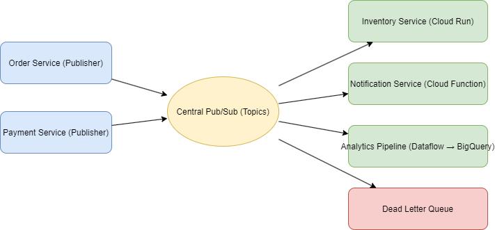

# Pub/Sub Architecture

Ever needed to let one component talk to many others without knowing who they are? 
It starts out innocent, but soon you're cooking spaghetti and getting tangled in dependencies.

Enter the Pub/Sub Pattern. "Don't call me, I'll call you."

## Core concept
At its heart, Pub/Sub is all about decoupling.

Publishers shout messages into the void: “Hey there! A new order just came in!”

Subscribers sit around waiting: “Oh, I only care about new orders with express shipping.”

The Broker plays matchmaker: delivering the right messages to the right listeners.

The beauty: publishers and subscribers don’t know each other exist. It’s like this blog post - I write it, and you read it, but we never meet.

## Two types of pub/sub
Pub/sub can be two different things, so let's define them first:
1. A design pattern (Observer pattern): a design pattern for event handling and communication between components.
2. An architectural style (event-driven systems): an architecture pattern for building distributed systems.

## Architecture Pattern
In an event-driven architecture, components communicate by publishing and subscribing to events. This is often implemented using a message broker or event bus.
### Components
- **Publisher**: The component that generates and sends events. It doesn't know who will receive
- **Subscriber**: The component that listens for specific events and reacts to them. It doesn't know who sent the event.
- **Broker**: The intermediary that routes events from publishers to subscribers based on their subscriptions.
- **Event**: A message or notification that something has happened. Events can carry data about the occurrence.

### Workflow
1. A publisher creates an event and sends it to the broker.
2. The broker checks its list of subscribers and forwards the event to those interested in that type.
3. Subscribers receive the event and process it accordingly.
4. The publisher and subscriber remain unaware of each other, promoting loose coupling.

### Benefits
- **Decoupling**: Publishers and subscribers are independent, making it easier to change or replace components.
- **Scalability**: New subscribers can be added without modifying publishers, allowing the system to grow.
- **Flexibility**: Different components can react to the same event in different ways.
- **Asynchronous Communication**: Events can be processed asynchronously, improving responsiveness.

I sketched a diagram to illustrate the idea:

#### Example
- Producers (Publishers)

These are your apps and microservices: Order Service, Payment Service, even IoT devices.

Instead of calling each other directly, they publish events to Pub/Sub topics like orders.created or payments.authorized.

- Event Broker (Central Pub/Sub)

Pub/Sub topics are like megaphones. Each one broadcasts events into the system.

Multiple subscriptions can listen to the same topic, each with its own filter, retry policy, and dead-letter queue.

- Subscribers (Consumers)

Cloud Run pulls events for operational logic (e.g., Inventory Service reserving stock).

Cloud Functions or Cloud Run (via Eventarc) handle push events like sending confirmation emails.

Dataflow (Apache Beam) processes streams for analytics, sinks data into BigQuery and Cloud Storage.

Notification Service pushes updates to end-users.

- Dead Letter Queues (DLQs)

When a subscriber fails too many times on a message, it goes into a DLQ topic for investigation.

Think of it as the “lost & found” for bad events.